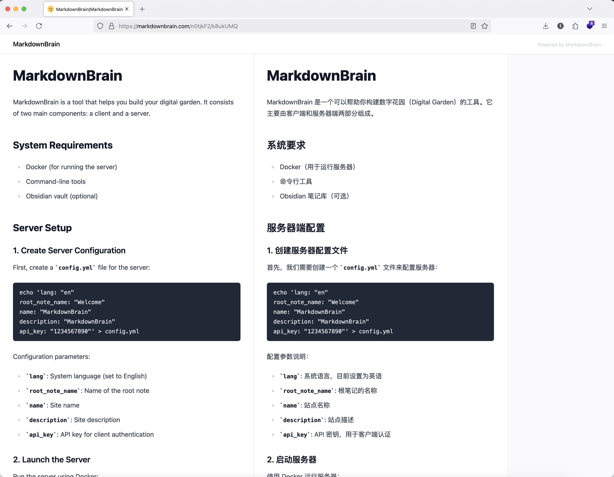

# MarkdownBrain

Make your digital garden with MarkdownBrain.



## Quick Start

### Client

#### Create client config.yml

```bash
echo 'source: "~/Library/Mobile Documents/com~apple~CloudDocs/obsidian/example"
server: "https://your-server-url"
api_key: "1234567890"
ignores:
  - "Templates"' > config.yml
```

> Note: The `source` is the path to your Obsidian vault.

#### Run cli

```bash
curl -L https://github.com/blackstorm/markdownbrain/releases/download/v0.1.1/markdownbrain-cli-darwin-amd64 -o markdownbrain-client
chmod +x markdownbrain-client
./markdownbrain-client -c config.yml
```
> Note: Before running the client, ensure the `server` is running.

### Server

#### Create config.yml
```bash
echo 'lang: "en"
root_note_name: "Welcome"
name: "MarkdownBrain"
description: "MarkdownBrain"
api_key: "1234567890"' > config.yml
```

#### Run Server

```bash
docker run -dit --name markdownbrain -v $(pwd)/config.yml:/markdownbrain/config.yml -p 3000:3000 ghcr.io/blackstorm/markdownbrain-server:latest
```